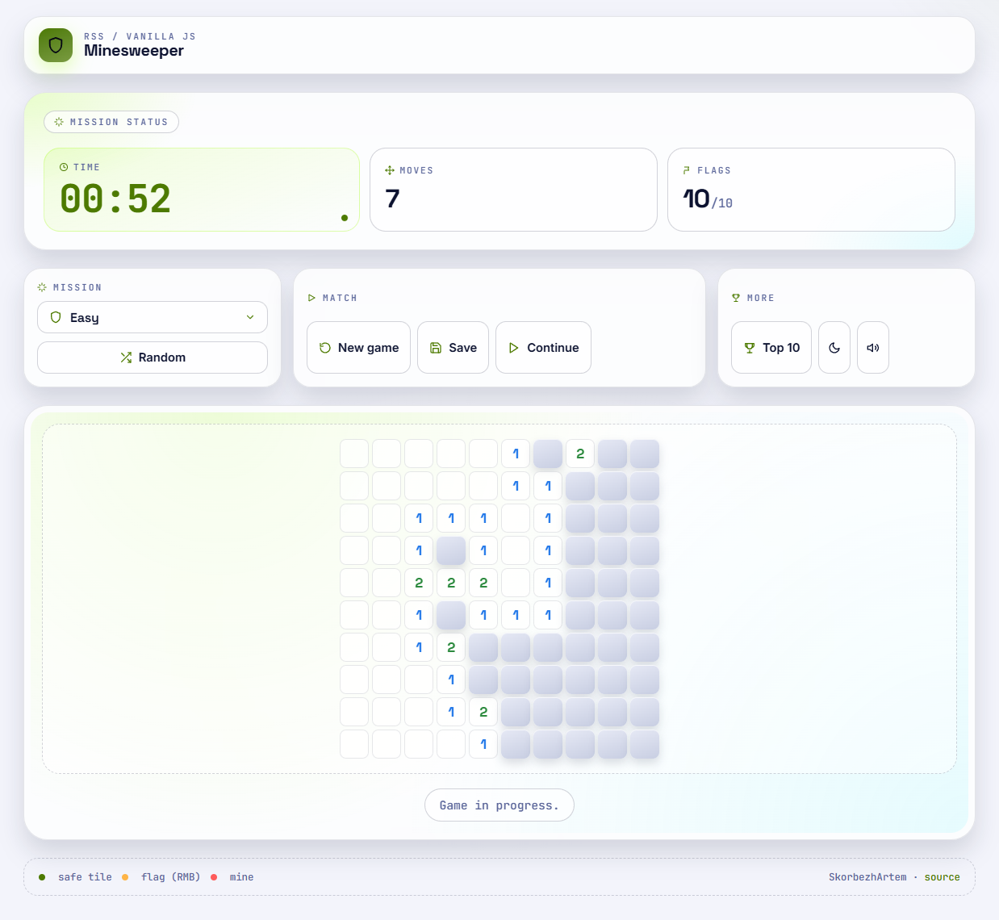

# RSS Minesweeper

Classic Minesweeper rebuilt in vanilla HTML, CSS and JavaScript with a
modern, "tactical-HUD" look. No frameworks, no jQuery, no
`alert`/`prompt`/`confirm`.

- **Live demo:** https://skorbezhartem.github.io/minesweeper/
- **Task:** [RSS Minesweeper](https://github.com/rolling-scopes-school/tasks/blob/master/tasks/minesweeper/README.md)



## Implemented requirements

### Basic

- [x] `body` in `index.html` is empty except the module `script` tag; the whole
      UI is generated in JavaScript.
- [x] Responsive layout — fits from 360px and up, board never overflows down to
      the smallest mobile sizes.
- [x] Default field size is 10×10 with 10 mines.
- [x] The game starts after the first left click.
- [x] Left-click reveals cells. Safe cells show the number of mines around them.
- [x] The game ends with a win after all safe cells are opened or with a loss
      after clicking a mine.
- [x] Win message format: `Hooray! You found all mines in ## seconds and N moves!`.
- [x] Lose message format: `Game over. Try again`.

### Advanced

- [x] Mines are placed after the first move, so the first click is always safe.
- [x] Right-click places and removes flags (the browser context menu is
      suppressed on the field).
- [x] Numbers 1–8 use different colors.
- [x] A new game can be started at any time without reloading the page.
- [x] Game duration is shown as a `mm:ss` clock. Unused flags are displayed
      next to the mine count.
- [x] Empty cells recursively open adjacent empty cells and nearest numbered
      cells.
- [x] Flags inside an automatically opened empty area are removed and the cells
      underneath are opened.

### Additional

- [x] WebAudio sound effects for reveal, flag, unflag, win and loss with a
      mute toggle.
- [x] Three difficulty levels: Easy 10×10, Medium 15×15 (40 mines), Hard 25×25
      (99 mines).
- [x] Top 10 fastest defuses live in `localStorage` and are shown in a
      dedicated modal with a podium (gold / silver / bronze).
- [x] Save / Continue last game through `localStorage`.
- [x] Random mission button (picks a different difficulty for variety).
- [x] Light and dark themes with persisted preference.
- [x] Custom select with a portalled popover (escapes parent stacking
      contexts so it never gets clipped).
- [x] Result modal after every win and loss, with mission summary and
      "New game" shortcut.
- [x] Animated favicon-style brand mark and Lucide-style SVG icons across the
      whole UI.

## Run locally

The app uses ES modules and Vite for a convenient local dev server.

1. Clone the repo and open the project folder:
   ```bash
   git clone https://github.com/SkorbezhArtem/minesweeper.git
   cd minesweeper
   ```
2. Install dependencies:
   ```bash
   npm install
   ```
3. Start the dev server:
   ```bash
   npm run start
   ```
4. Open the local URL printed by Vite.

## Available scripts

```bash
npm run start   # start the local Vite dev server
npm run lint    # run ESLint (Airbnb base config)
npm run build   # create the production build in minesweeper/dist
npm run deploy  # publish the production build to GitHub Pages
```

## Technical notes

- Vanilla JavaScript with ES modules — no Angular, React, Vue, TypeScript or
  jQuery.
- Game logic (`board.js`, `state.js`) is separated from DOM rendering
  (`render.js`).
- `localStorage` values are parsed defensively, so corrupted saved data never
  breaks the app.
- ESLint with Airbnb base config keeps the code style consistent.
- GitHub Pages deployment is generated from the Vite production build via
  `gh-pages`.

## Project structure

```text
minesweeper/
  index.html
  src/
    assets/favicon.svg      App favicon
    css/style.css           Theme variables, layout, animations
    js/
      main.js               Entry point
      constants.js          Game constants and difficulty settings
      state.js              Fresh game state factory
      board.js              Board, mines, neighbors, recursive reveal
      game.js               Game flow and event handlers
      render.js             DOM creation, popover and modal helpers
      storage.js            localStorage helpers (save, scores, theme)
      timer.js              Timer lifecycle and mm:ss formatting
      sound.js              WebAudio sound effects with mute toggle
      icons.js              Lucide-style inline SVG icon helper
```
